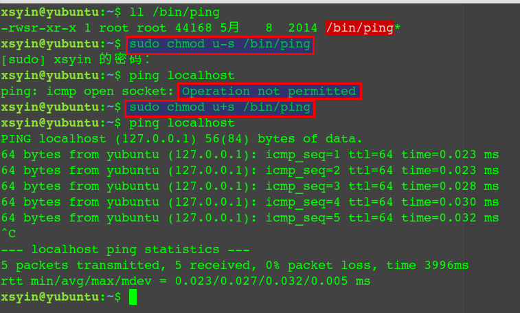
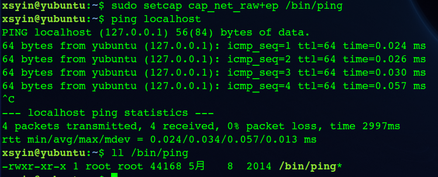
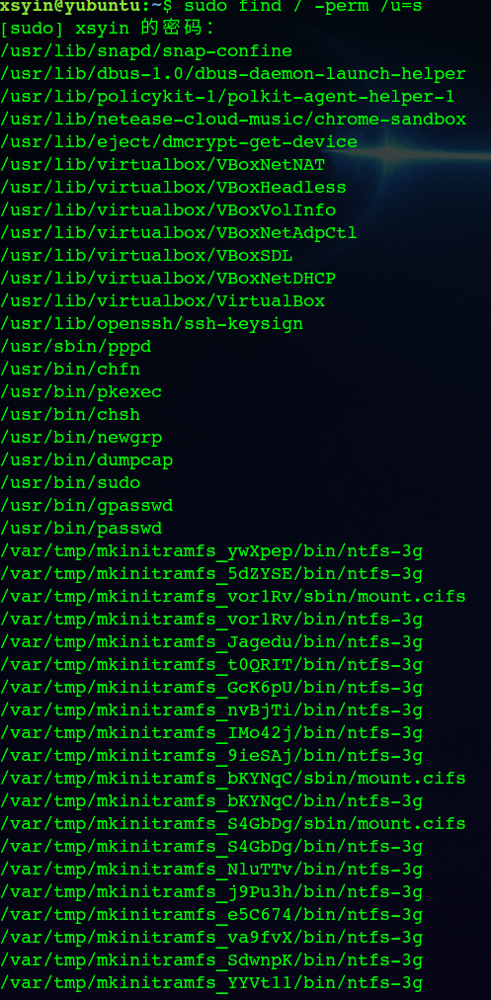
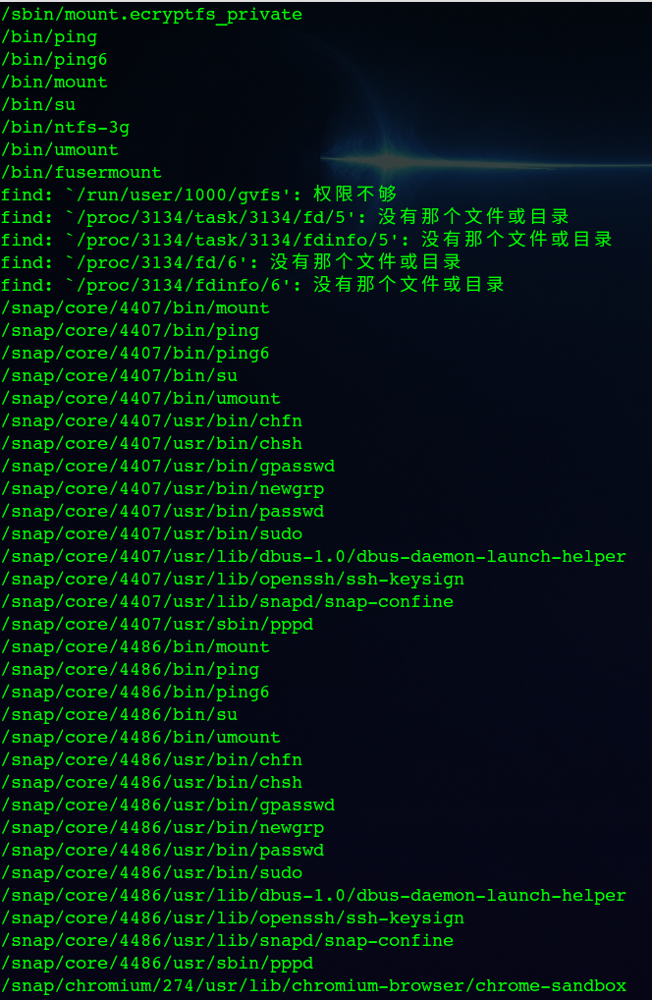
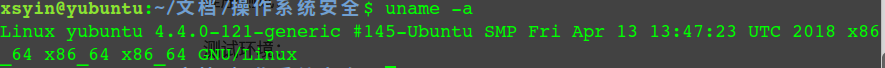
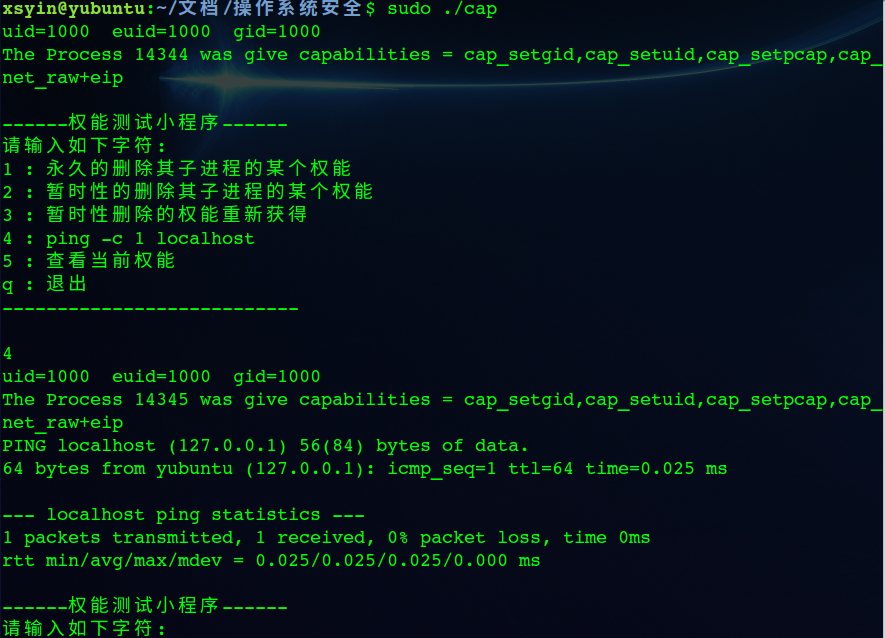
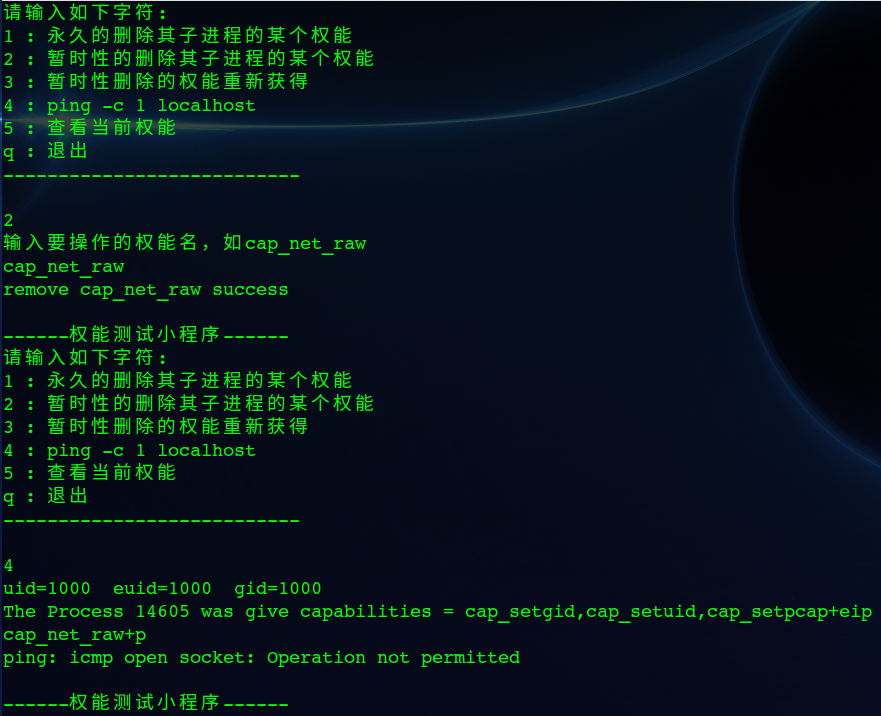
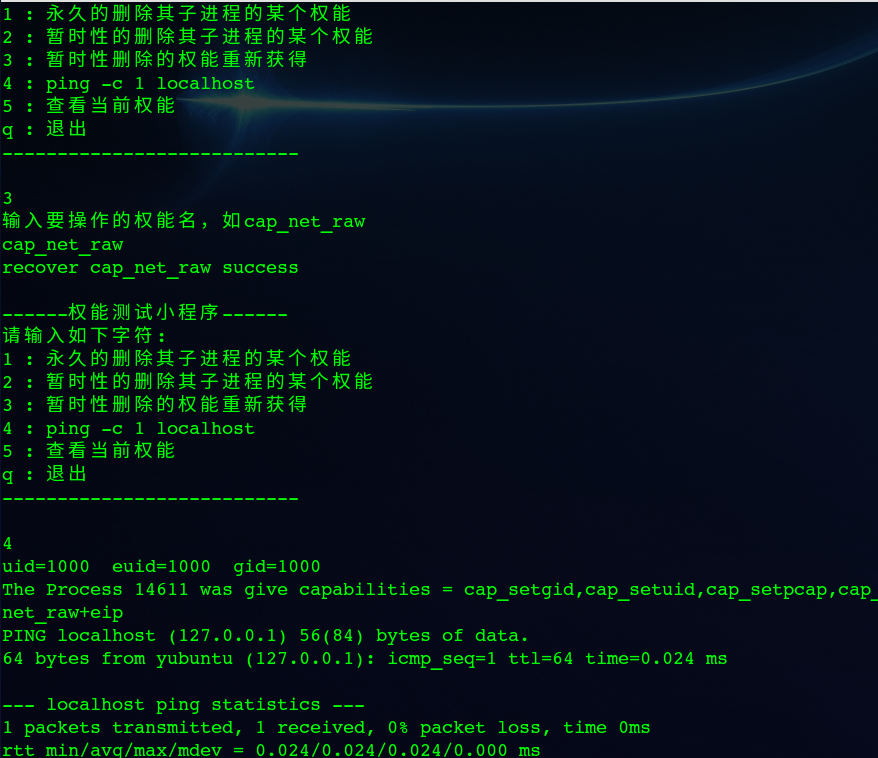
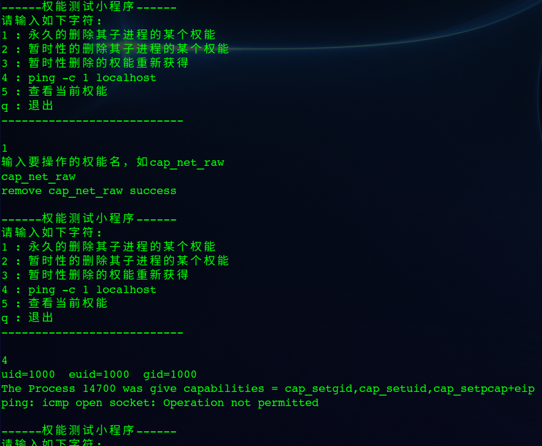

# 操作系统安全实验二

1. `passwd​` ，  ​`sudo​`， `ping​` 等命令会修改关键文件，确保非`root​` 用户无法修改，因此需要转换为`root​` 用户，而`setuid​` 位可以让用户暂时获得文件拥有者`root​` 的身份。

   以`ping` 命令为例，删除`s` 位后无法`ping` ，因为没有打开`socket` 的权限。而当将`s` 位重新设置时，又可以`ping`  ：

   

   为了执行权限检查，传统的 UNIX 实现区分两种类型的进程：特权进程（其有效用户 ID 为0，称为超级用户或 root），和非特权用户（其有效 UID 非0）。特权进程绕过所有的内核权限检查，而非特权进程受基于进程的认证信息（通常是：有效 UID，有效 GID，和补充组列表）的完整权限检查的支配。

   自内核 2.2 版本开始，Linux 将传统上与超级用户关联的特权分为几个单元，称为 capabilities （权能），它们可以被独立的启用或禁用。权能是每个线程的属性。权能相当于规范了你这个程序所拥有的权限。相当于特权的需求的细化。当执行特权操作的时候，可以查看是否有相应的权能。

   `ping` 命令需要`CAP_NET_RAW`的权能，使用`setcap`为其添加权能：

   

   可以`ping` ，且没有设置`uid` 位。

2. 使用`man capabilities`  可以查看权能列表及相应的解释：

- **CAP_AUDIT_CONTROL**（自 Linux 2.6.11）
  启用和禁用内核审计；修改审计过滤器规则；提取审计状态和过滤规则。

- **CAP_AUDIT_READ**（自 Linux 3.16）
  允许通过一个多播 netlink socket 读取审计日志。

- **CAP_AUDIT_WRITE**（自 Linux 2.6.11）
  向内核审计日志写记录。

- **CAP_BLOCK_SUSPEND**（自 Linux 3.5）
  可以阻塞系统挂起（**epoll**(7) **EPOLLWAKEUP**，*/proc/sys/wake_lock*）的特性。

- **CAP_CHOWN**
  对文件的 UIDs 和 GIDs 做任意的修改（参考 **chown**(2)）。

- **CAP_DAC_OVERRIDE**
  绕过文件的读，写，和执行权限检查。（DAC 是 “discretionary access control” 的缩写。）

- CAP_DAC_READ_SEARCH

  - 绕过文件的读权限检查和目录的读和执行权限检查；
  - 调用 **open_by_handle_at**(2)。

- CAP_FOWNER

  - 对于通常要求进程的文件系统 UID 与文件的 UID 匹配的操作，绕过权限检查 (比如，**chmod**(2)，**utime**(2))，除了那些包含在 **CAP_DAC_OVERRIDE** 和 **CAP_DAC_READ_SEARCH** 中的操作；
  - 为任意文件设置扩展文件属性(参考 **chattr**(1))；
  - 为任意文件设置访问控制表(ACLs)；
  - 对文件删除操作忽略目录的 sticky 位；
  - 在 **open**(2) 和 **fcntl**(2) 任意文件时设置 **O_NOATIME**。

- **CAP_FSETID**
  当文件修改时不清除 set-user-ID 和 set-group-ID 模式位；为文件 GID 与调用进程的文件系统或补充 GIDs 不匹配的文件设置 set-group-ID 位。

- **CAP_IPC_LOCK**
  锁定内存 (**mlock**(2)，**mlockall**(2)，**mmap**(2)，**shmctl**(2))。

- **CAP_IPC_OWNER**
  绕过对 System V IPC 对象的操作的权限检查。

- **CAP_KILL**
  绕过发送信号 (参考 **kill**(2)) 时的权限检查。这包括使用 **ioctl**(2) **KDSIGACCEPT** 操作。

- **CAP_LEASE**（自 Linux 2.4）
  为任意文件建立租约 (参考 **fcntl**(2))。

- **CAP_LINUX_IMMUTABLE**
  设置**FS_APPEND_FL** 和 **FS_IMMUTABLE_FL** inode 标记 (参考 **chattr**(1))。

- **CAP_MAC_ADMIN**（自 Linux 2.6.25）
  覆盖强制访问控制 (Mandatory Access Control (MAC)). 为 Smack Linux 安全模块(Linux Security Module (LSM)) 而实现。

- **CAP_MAC_OVERRIDE**（自 Linux 2.6.25）
  允许 MAC 配置或状态改变。为 Smack LSM 而实现。

- **CAP_MKNOD**（自 Linux 2.4）
  使用 **mknod**(2) 创建特殊文件。

- CAP_NET_ADMIN

  执行多种网络有关的操作：

  - 接口配置；
  - IP 防火墙，地址伪装，和账单管理；
  - 修改路由表；
  - 为透明代理绑定任何地址；
  - 设置服务类性 (type-of-service (TOS))；
  - 清理驱动统计资料；
  - 设置混杂模式；
  - 启用组播；
  - 使用 **setsockopt**(2) 设置下列 socket 选项：**SO_DEBUG**，**SO_MARK**，**SO_PRIORITY** (在0到6范围之外的优先级)，**SO_RCVBUFFORCE**，和 **SO_SNDBUFFORCE**。

- **CAP_NET_BIND_SERVICE**
  将一个 socket 绑定到一个互联网域特权端口 (端口号小于 1024)。

- **CAP_NET_BROADCAST**
  (未使用) 使 socket 发送组播，并监听组播。

- CAP_NET_RAW

  - 使用 RAW 和 PACKET sockets；
  - 为透明代理绑定任何地址。

- **CAP_SETGID**
  执行任意的进程 GIDs 和补充 GID 列表管理；当通过 UNIX 域 sockets 传递 socket 认证信息时伪造 GID；在一个用户命名空间 (参考 **user_namespaces**(7)) 中写入组 ID 映射。

- CAP_SETFCAP (since Linux 2.6.24)
   设置文件的权能。

- CAP_SETPCAP

  如果文件权能不受支持：授予或删除调用者功能设置位或来自任何其他进程的任何权能。 （当内核配置为支持文件功能时，CAP_SETPCAP的此属性不可用，因为CAP_SETPCAP对于这样的内核具有完全不同的语义。）

  如果支持文件权能：从调用线程的边界集中添加任意权能到其可继承位;从边界集中删除权能（通过prctl（2）PR_CAPBSET_DROP）;
            对securebits标志进行更改。

- CAP_SETUID


- CAP_SYS_ADMIN

  - 执行一系列系统管理操作，包括：**quotactl**(2)，**mount**(2)，**umount**(2)，**swapon**(2)，**swapoff**(2)，**sethostname**(2)，和 **setdomainname**(2)；
  - 执行特权 syslog(2) 操作 (自 Linux 2.6.37 开始，应该使用 CAP_SYSLOG 来允许这一操作)；
  - 执行 **VM86_REQUEST_IRQ vm86**(2) 命令；
  - 对任意 System V IPC 对象执行 IPC_SET 和 IPC_RMID 操作；
  - 覆盖 RLIMIT_NPROC 资源限制；
  - 执行 trusted 和 security Extended Attributes (see **xattr**(7)) 操作；
  - 使用 **lookup_dcookie**(2)；
  - 使用 ioprio_set(2) 来分配 IOPRIO_CLASS_RT 和 (Linux 2.6.25 之前) IOPRIO_CLASS_IDLE I/O 调度类别；
  - 当通过 UNIX 域 sockets 传递 socket 认证信息时伪装 PID；
  - 在系统调用打开文件 (比如，**accept**(2)，**execve**(2)，**open**(2)，**pipe**(2)) 时，超出 /proc/sys/fs/file-max，系统范围内打开文件数的限制；
  - 通过 **clone**(2) 和 **unshare**(2) 使用 **CLONE_\*** 标记创建新的命名空间（但是，自从 Linux 3.8 开始，创建命名空间不需要任何权能）；
  - 调用 **perf_event_open**(2)；
  - 访问特权 perf 事件信息；
  - 调用 **setns**(2) (在目标命名空间中需要 CAP_SYS_ADMIN)；
  - 调用 **fanotify_init**(2)；
  - 调用 **bpf**(2)；
  - 执行 **KEYCTL_CHOWN** 和 **KEYCTL_SETPERM keyctl**(2) 操作；
  - 执行 **madvise**(2) **MADV_HWPOISON** 操作；
  - 使用 **TIOCSTI ioctl**(2) 向一个终端的输入队列中插入字符，而不是调用者的控制终端；
  - 使用废弃的 **nfsservctl** (2) 系统调用；
  - 使用废弃的 **bdflush** (2) 系统调用；
  - 执行各种特权的块设备 **ioctl**(2) 操作；
  - 执行各种特权的文件系统 **ioctl**(2) 操作；
  - 对许多设备驱动执行管理操作。

- **CAP_SYS_BOOT**
  使用 **reboot**(2) 和 **kexec_load**(2)。

- **CAP_SYS_CHROOT**
  使用 **chroot**(2)。

- **CAP_SYS_MODULE**
  加载和卸载内核模块(参考 **init_module**(2) 和 **delete_module**(2))；在 2.6.25 之前的内核中：从系统范围内的权能边界集合中丢弃权能。

- CAP_SYS_NICE

  - 触发进程 nice 值 (**nice**(2)，**setpriority**(2)) 和为任意进程改变 nice 值；
  - 为调用进程设置实时调度策略，及为任意进程设置调度策略和优先级 (**sched_setscheduler**(2)，**sched_setparam**(2)，**shed_setattr**(2))；
  - 为任意进程设置 CPU affinity (**sched_setaffinity**(2))；
  - 为任意进程设置 I/O 调度类别和优先级 (**ioprio_set**(2))；
  - 对任意进程应用 **migrate_pages**(2) 并允许进程被迁移到任意节点；
  - 对任意进程应用 **move_pages**(2)；
  - 在 **mbind**(2) 和 **move_pages**(2) 中使用 **MPOL_MF_MOVE_ALL** 标记。

- **CAP_SYS_PACCT**
  使用 **acct**(2)。

- CAP_SYS_PTRACE

  - 使用 **ptrace**(2) 追踪任意进程；
  - 对任意进程应用 **get_robust_list**(2)；
  - 使用 **process_vm_readv**(2) 和 **process_vm_writev**(2) 同任意进程的内存传输数据；
  - 使用 **kcmp**(2) 检查进程。

- CAP_SYS_RAWIO

  - 执行 I/O 端口操作 (**iopl**(2) 和 **ioperm**(2))；
  - 访问 /proc/kcore；
  - 使用 **FIBMAP ioctl**(2) 操作；
  - 打开设备访问 x86 模式特有寄存器 (MSRs，参考 **msr**(4))；
  - 更新 /proc/sys/vm/mmap_min_addr；
  - 在地址低于 /proc/sys/vm/mmap_min_addr 的位置创建内存映射；
  - 在 /proc/bus/pci 中映射文件；
  - 打开 /dev/mem 和 /dev/kmem；
  - 执行各种 SCSI 设备命令；
  - 在 **hpsa**(4) 和 **cciss**(4) 设备上执行某一操作；
  - 在其它设备上执行一系列设备特有操作。

- CAP_SYS_RESOURCE

  - 使用 ext2 文件系统上的预留空间；
  - 执行 ioctl(2) 调用控制 ext3 日志；
  - 覆盖磁盘配额限制；
  - 增加资源限制 (参考 **setrlimit**(2))；
  - 覆盖 RLIMIT_NPROC 资源限制；
  - 在终端分配上覆盖最大的终端数；
  - 覆盖最大的 keymaps 个数；
  - 允许实时时钟中断大于64 hz；
  - 触发一个 System V 消息队列的 msg_qbytes 限制超过 /proc/sys/kernel/msgmnb 中的限制 (参考 **msgop**(2) 和 **msgctl**(2))；
  - 当使用 **F_SETPIPE_SZ fcntl**(2) 命令设置一个管道的容量时覆盖 /proc/sys/fs/pipe-size-max 的限制；
  - 使用 **F_SETPIPE_SZ** 增加管道的容量超出 /proc/sys/fs/pipe-max-size 指定的限制；
  - 当创建 POSIX 消息队列 (参考 **mq_overview**(7)) 时覆盖 /proc/sys/fs/mqueue/queues_max 的限制；
  - 使用 **prctl**(2) **PR_SET_MM** 操作；
  - 设置 /proc/PID/oom_score_adj 为一个小于由一个具有 CAP_SYS_RESOURCE 的进程最近设置的值的值。

- **CAP_SYS_TIME**
  设置系统时钟 (**settimeofday**(2)，**stime**(2)，**adjtimex**(2))；设置实时 (硬件) 时钟。

- **CAP_SYS_TTY_CONFIG**
  使用 **vhangup**(2)；对虚拟终端使用各种特权 **ioctl**(2) 操作。

- CAP_SYSLOG

  (自 Linux 2.6.37)

  - 执行特权 **syslog**(2) 操作。参考 **syslog**(2) 来获取哪些操作需要特权的信息；
  - 当 /proc/sys/kernel/kptr_restrict 值为 1 时，查看通过 /proc 和其它接口暴露
    的内核地址。(参考 **proc**(5) 中 kptr_restrict 的讨论。)

- **CAP_WAKE_ALARM** (自 Linux 3.0)
  触发将唤醒系统的东西 (设置 CLOCK_REALTIME_ALARM 和 CLOCK_BOOTTIME_ALARM 定时器)

3. 找出所有设置`uid` 位程序，使用以下命令：

```
find / -perm /u=s
find / -perm -4000
```

结果如下：





部分需要的权能如下：

| 程序            | 需要的权能                              |
| --------------- | --------------------------------------- |
| /bin/ping       | CAP_NET_RAW                             |
| /bin/mount      | CAP_SYS_ADMIN                           |
| /bin/su         | CAP_DAC_OVERRIDE,CAP_SETGID,CAP_SETUID  |
| /bin/fusermount | CAP_SYS_ADMIN                           |
| /bin/umount     | CAP_SYS_ADMIN                           |
| /usr/bin/passwd | CAP_CHOWN ,CAP_DAC_OVERRIDE ,CAP_FOWNER |

4. 在linux中，文件权能有如下三种：

   - effective：当前有效的权能，执行某特权操作时，操作系统检查cap_effective的对应位是否有效,而不再是检查进程的有效UID是否为0。
   - permitted：当前进程所有能使用的能力，effective包含于permitted
   - inheritable：可以被继承的能力

   linux程序调用子程序，权能变换公式如下：

   ```python
   P’(ambient) = (file is privileged) ? 0 : P(ambient)
   P'(permitted) = (P(inheritable) & F(inheritable)) | (F(permitted) & cap_bset)| P’(ambient)
   P'(effective) = F(effective) ? P'(permitted) : P’(ambient)
   P'(inheritable) = P(inheritable) [i.e., unchanged]
   ```

   其中：

   - P denotes the value of a thread capability set before the execve(2)
   - P’ denotes the value of a capability set after the execve(2)
   - F denotes a file capability set
   - cap_bset is the value of the capability bounding set (described below).

   A privileged file is one that has capabilities or has the set-user-ID or set-group-ID bit set.

实现一个程序其满足以下的功能：

- 能够永久的删除其子进程的某个权能。
- 能暂时性的删除其子进程的某个权能。
- 能让上面被暂时性删除的权能重新获得

以ping为例，我们知道ping需要的权能为cap_net_raw，为了能在execve后执行ping，即execve中的ping有cap_net_raw权能，根据上面的变换规则：

- 设置/bin/ping权能为cap_net_raw+ei，使得可以继承
  - sudo setcap cap_net_raw+ei /bin/ping
- 设置当前的进程的权能有cap_net_raw+i权能

永久删除子进程的权能就移除effective和inheritable、permitted的，暂时性删除就移除effective和inheritable的，恢复暂时性删除的就添加进effective和inheritable。

```c
#include <stdio.h>
#include <stdlib.h>
#include <string.h>
#include <sys/types.h>
#include <unistd.h>
#include <sys/capability.h>
#include <sys/prctl.h>
#undef _POSIX_SOURCE

extern int errno;

void whoami() {
    printf("uid=%i  euid=%i  gid=%i\n", getuid(), geteuid(), getgid());
}


void listCaps(){
    cap_t caps = cap_get_proc();
    ssize_t y = 0;
    printf("The Process %d was give capabilities %s\n",(int) getpid(), cap_to_text(caps, &y));
    fflush(0);
    cap_free(caps);
}


void do_ping(){
	if(!fork()){
		whoami();
		listCaps();
		execlp("ping","ping","-c 1","localhost",NULL);
	}
}


void init(){
	if(getuid() != 0){
		puts("请使用sudo执行本程序");
		exit(1);
	}
		
	cap_value_t cap_values[] = {CAP_SETUID, CAP_SETGID, CAP_SETPCAP ,CAP_NET_RAW};

    cap_t caps = cap_init();
    cap_set_flag(caps, CAP_PERMITTED, 4, cap_values, CAP_SET);
	cap_set_flag(caps, CAP_EFFECTIVE, 4, cap_values, CAP_SET);
    cap_set_proc(caps);
    prctl(PR_SET_KEEPCAPS, 1, 0, 0, 0);
    cap_free(caps);

    setgid(1000);
	setuid(1000);
	
    caps = cap_get_proc();
    cap_set_flag(caps, CAP_EFFECTIVE, 4, cap_values, CAP_SET);
	cap_set_flag(caps, CAP_INHERITABLE, 4, cap_values, CAP_SET);
    cap_set_proc(caps);
    cap_free(caps);
	whoami();
	listCaps();
}

void printInfo(){
	puts("\n------权能测试小程序------\n\
请输入如下字符:\n\
1 : 永久的删除其子进程的某个权能\n\
2 : 暂时性的删除其子进程的某个权能\n\
3 : 暂时性删除的权能重新获得\n\
4 : ping -c 1 localhost\n\
5 : 查看当前权能\n\
q : 退出\n\
---------------------------\n");
}

int main(int argc, char **argv)
{
	init();
	char line[128];
	printInfo();
	while(fgets(line, sizeof(line), stdin)){
		char cmd = line[0];

		if(cmd == '1' || cmd == '2' || cmd == '3'){
			printf("输入要操作的权能名，如cap_net_raw\n");
			fgets(line, sizeof(line), stdin);
			line[strlen(line) - 1] = '\0';
			cap_value_t temp;
			if(cap_from_name(line, &temp) < 0){
				printf("Error capability name\n");
			}
			else{
				cap_t caps = cap_get_proc();

				if(cmd == '3'){
					cap_set_flag(caps, CAP_EFFECTIVE, 1, &temp, CAP_SET);
					cap_set_flag(caps, CAP_INHERITABLE, 1, &temp, CAP_SET);
				}
				else{
					cap_set_flag(caps, CAP_EFFECTIVE, 1, &temp, CAP_CLEAR);
					cap_set_flag(caps, CAP_INHERITABLE, 1, &temp, CAP_CLEAR);
					if(cmd == '1')
						cap_set_flag(caps, CAP_PERMITTED, 1, &temp, CAP_CLEAR);
				}
				if(cap_set_proc(caps))
					perror("cap_set_proc() ERROR: ");
				else
					printf("%s %s success\n", (cmd =='3'? "recover":"remove"),line);

				cap_free(caps);
			}
		}
		else if(cmd == '4')
			do_ping();
 		else if(cmd == '5')
			listCaps();
		else if(cmd == 'q')
			break;
       sleep(1);  //休眠1s
		printInfo();
	}
    return 0;
}

```

程序测试：

测试环境：



运行程序前：`sudo setcap cap_net_raw+eip /bin/ping`  保证文件有`eip` 权能

* sudo apt install libcap-dev


* gcc cap.c -lcap -o cap
* sudo ./cap

一开始可以`ping` :



暂时性删除权能后无法`ping` :



恢复后可以`ping`  :



永久删除后无法`ping` :




### 参考资料

[Linux setuid与权能介绍](https://www.hrwhisper.me/introduction-to-linux-capability/#comments)

[Linux 权能综述](https://www.wolfcstech.com/2017/07/10/linux-capabilities-overview/)

